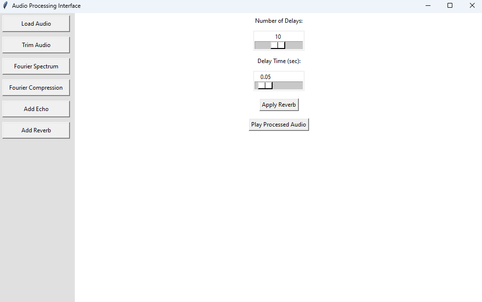

# Audio Processing Application

## Overview
This is a Python-based GUI application for processing audio files using various signal processing techniques. The application is built with **Tkinter** for the graphical interface and **NumPy, SciPy, and SoundFile** for signal processing. It allows users to load an audio file, apply transformations, visualize the frequency spectrum, and listen to the modified audio.

## Example 


## Features
- **Load and Play Audio**: Users can load a `.wav` or `.mp3` file and play it through their default media player.
- **Trim Audio**: Allows users to cut the audio to a specified duration.
- **Fourier Spectrum Analysis**: Displays the frequency spectrum of the loaded audio file.
- **Fourier Compression**: Removes high frequencies, preserving only a fraction of the lower frequencies.
- **Echo Effect**: Adds a delayed echo to the audio.
- **Reverb Effect**: Simulates reverberation by adding multiple delayed copies of the audio.

## Dependencies
Before running the application, ensure you have the following Python libraries installed:

```sh
pip install numpy scipy soundfile matplotlib tkinter
```

## How to Use
1. **Run the Application**
   ```sh
   python audio_processing_app.py
   ```

2. **Load an Audio File**
   - Click **Load Audio** and select a `.wav` or `.mp3` file.
   - A button to play the original audio will appear.

3. **Apply Effects**
   - Use the side menu to navigate between different effects.
   - Each effect panel includes sliders to adjust parameters.
   - Click the **Apply** button to modify the audio.
   - Click **Play Processed Audio** to listen to the changes.

4. **Save Processed Audio**
   - The modified audio is automatically saved as `processed_audio.wav`.

## Functionality Breakdown

### **Trim Audio**
- Trims the audio to a specified duration in seconds.
- Implemented in `trim_audio(audio, sr, duration)`.

### **Fourier Spectrum Analysis**
- Computes and visualizes the frequency spectrum using **Fast Fourier Transform (FFT)**.
- Implemented in `plot_audio_spectrum(audio, sr)`.

### **Fourier Compression**
- Removes high-frequency components while preserving a percentage of the lower frequencies.
- Implemented in `compress_audio(audio, p)` where `p` is the fraction of low frequencies retained.

### **Echo Effect**
- Adds a delayed copy of the audio signal with a reduced amplitude.
- Implemented in `add_echo(audio, sr, delay, echo_gain)` where:
  - `delay` = delay in seconds
  - `echo_gain` = amplitude of the echoed signal

### **Reverb Effect**
- Adds multiple delayed copies of the audio with decreasing amplitude to simulate reverberation.
- Implemented in `add_reverb(audio, sr, num_delays, delay_time)` where:
  - `num_delays` = number of echo repetitions
  - `delay_time` = time between echoes (seconds)

## Application Interface
- **Left Sidebar**: Buttons to select different effects.
- **Right Panel**: Displays effect-specific controls and visualizations.
- **Buttons**:
  - Load, apply effects, play audio, and view Fourier spectrum.
- **Embedded Spectrum Plot**: Fourier spectrum is displayed directly in the GUI.

## Future Improvements
- playback uses the system's default player (`os.startfile` on Windows), which may not work on Linux/macOS.
- Future versions could integrate an in-app audio player.
- More audio effects, such as equalization and noise reduction, could be added.

This project is open-source and can be modified and distributed freely.

